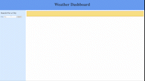

# Weather Dashboard

## Technology Used 

| Technology Used         | Resource URL           | 
| ------------- |:-------------:| 
| HTML    | [developer.mozilla.org](https://developer.mozilla.org/en-US/docs/Web/HTML) | 
| CSS     | [developer.mozilla.org](https://developer.mozilla.org/en-US/docs/Web/CSS)      |   
| Git | [git-scm.com](https://git-scm.com/)     |    
| jQuery | [api.jquery.com](https://jquery.com/) |
| Open Weather API | [openweathermap.org](https://openweathermap.org/api)

## Description 

[Visit the Deployed Site](https://megellman.github.io/weather-dashboard/)

For this project, I created a weather dashboard. When a user enters a city into the search bar, the current weather data for today will appear as well as weather predictions for the next five days. After the user searches for a city, a button will appear in the sidebar with that city's name. If the user searches up a new city and wants to look at the weather data of the previous city, they can click on the city button to make the weather data appear again. 

I used two APIs from openweathermap.org. One API provides the current weather data for a given location. The other API provides hourly weather data for the next five days.





## Table of Contents

If your README is very long, add a table of contents to make it easy for users to find what they need.

* [Code Example](#code-example)
* [Learning Points](#learning-points)
* [Author Info](#author-info)
* [Credits](#credits)
* [License](#license)

## Code Example

To be able to access the previously searched city data at the click of a button, I saved the data I needed into an object and set it's key to the name of the city that was searched. 

```
            var currentInfo = {
                weatherHeader: data.name,
                date: format.toLocaleDateString(),
                temp: `Temp: ${data.main.temp} \u00B0F`,
                wind: `Wind: ${data.wind.speed} MPH`,
                humidity: `Humidity: ${data.main.humidity} %`,
                icon: `http://openweathermap.org/img/w/${data.weather[0].icon}.png`
            }
            localStorage.setItem(city.val(), JSON.stringify(currentInfo));
```
Then I created a container to house all of the city buttons. When one was clicked, the function would run for the corresponding city button. This function gets the corresponding object from local storage and replaces the text content of each item with the values from the object. The only exception is the image since it did not have text content. For image, I replaced the src link with the corresponding city image src link. 
```
  $('#btnContainer').on('click', function (e) {
        var btnObject = JSON.parse(localStorage.getItem(e.target.innerText));
        event.stopPropagation();
        $('#weather-header').text(btnObject.weatherHeader);
        $('#date').text(btnObject.date);
        $('#icon').attr('src', btnObject.icon);
        $('#temp').text(btnObject.temp);
        $('#wind').text(btnObject.wind);
        $('#humidity').text(btnObject.humidity);
```

## Learning Points
This was my first time using APIs. The most important thing I learned was definitely how to read the API documentation. Originally, I found an API call that would provide the current weather data, but I would need to find the city name, state code, and country code. While possible, this would take longer and would require more code. After reading through the documentation, I found an API call that would provide the current weather data and only needed the city name. 

## Author Info

### Megan Ellman

[LinkedIn](https://www.linkedin.com/in/megan-ellman/)

[GitHub](https://github.com/megellman)

[Portfolio](https://megellman.github.io/portfolio/)

## Credits 

|Resource | Link |
|-------|:-------:|
|On Click Events | [api.jquery.com](https://api.jquery.com/on/#on-events-selector-data-handler) |
| Local Storage   | [developer.mozilla.org](https://developer.mozilla.org/en-US/docs/Web/API/Window/localStorage) |
| Fetch URL | [developer.mozilla.org](https://developer.mozilla.org/en-US/docs/Web/API/Fetch_API/Using_Fetch)
|Open Weather API | [openweathermap.org](https://openweathermap.org/current)


## License

MIT License

Copyright (c) [2023] [Megan Ellman]

Permission is hereby granted, free of charge, to any person obtaining a copy
of this software and associated documentation files (the "Software"), to deal
in the Software without restriction, including without limitation the rights
to use, copy, modify, merge, publish, distribute, sublicense, and/or sell
copies of the Software, and to permit persons to whom the Software is
furnished to do so, subject to the following conditions:

The above copyright notice and this permission notice shall be included in all
copies or substantial portions of the Software.

THE SOFTWARE IS PROVIDED "AS IS", WITHOUT WARRANTY OF ANY KIND, EXPRESS OR
IMPLIED, INCLUDING BUT NOT LIMITED TO THE WARRANTIES OF MERCHANTABILITY,
FITNESS FOR A PARTICULAR PURPOSE AND NONINFRINGEMENT. IN NO EVENT SHALL THE
AUTHORS OR COPYRIGHT HOLDERS BE LIABLE FOR ANY CLAIM, DAMAGES OR OTHER
LIABILITY, WHETHER IN AN ACTION OF CONTRACT, TORT OR OTHERWISE, ARISING FROM,
OUT OF OR IN CONNECTION WITH THE SOFTWARE OR THE USE OR OTHER DEALINGS IN THE
SOFTWARE.